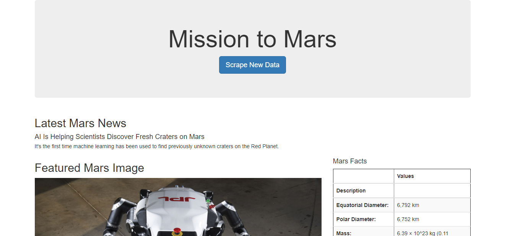
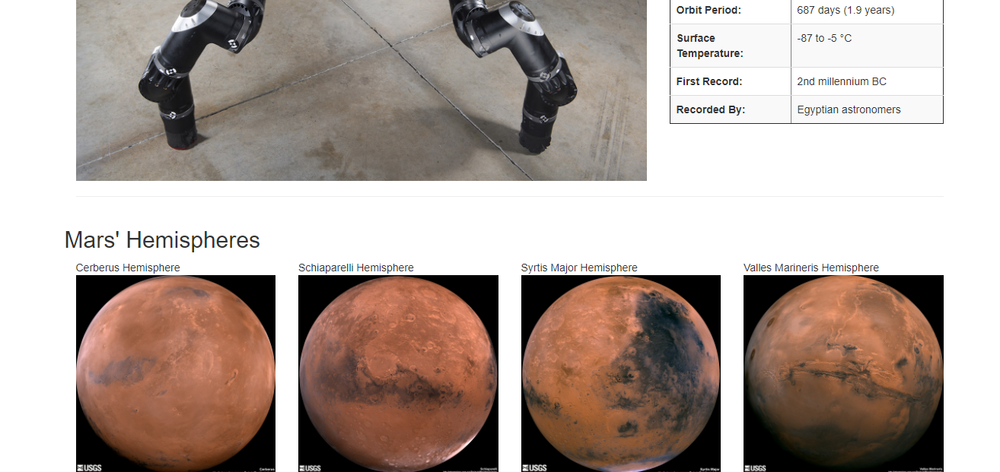

# Web Scraping - Mission to Mars

In this project, a web application is built that scrapes various websites for data related to the Mission to Mars and displays the information in a single HTML page. The following outlines what was done.

## Step 1 - Scraping

Using Jupyter Notebook, BeautifulSoup, Pandas, and Requests/Splinter, various Nasa Mars sites are scraped to gather information for the flask app.

### NASA Mars News

* Collected the latest News Title and Paragraph Text. 

  

### JPL Mars Space Images - Featured Image

* Visited the url for JPL Featured Space Image [here](https://www.jpl.nasa.gov/spaceimages/?search=&category=Mars).

* Used splinter to navigate the site and find the image url for the current Featured Mars Image.

  

### Mars Facts

* Visited the Mars Facts webpage [here](https://space-facts.com/mars/) and used Pandas to scrape the table containing facts about the planet including Diameter, Mass, etc.

* Used Pandas to convert the data to a HTML table string.

  

### Mars Hemispheres

* Visit the USGS Astrogeology site [here](https://astrogeology.usgs.gov/search/results?q=hemisphere+enhanced&k1=target&v1=Mars) to obtain high resolution images for each of Mar's hemispheres.

## Step 2 - MongoDB and Flask Application

Used MongoDB with Flask templating to create a new HTML page that displays all of the information that was scraped from the URLs above.

* Converted Jupyter notebook into a Python script called `scrape_mars.py` with a function called `scrape` that executed all of the scraping code from above and returned one Python dictionary containing all of the scraped data.

* Next, created a route called `/scrape` imports the `scrape_mars.py` script and calls on the `scrape` function.

  * Stores the return value in Mongo as a Python dictionary.

* Created a root route `/` that queries the Mongo database and passes the mars data into an HTML template to display the data.

* Created a template HTML file called `index.html` that takes the mars data dictionary and displays all of the data in the appropriate HTML elements. 

